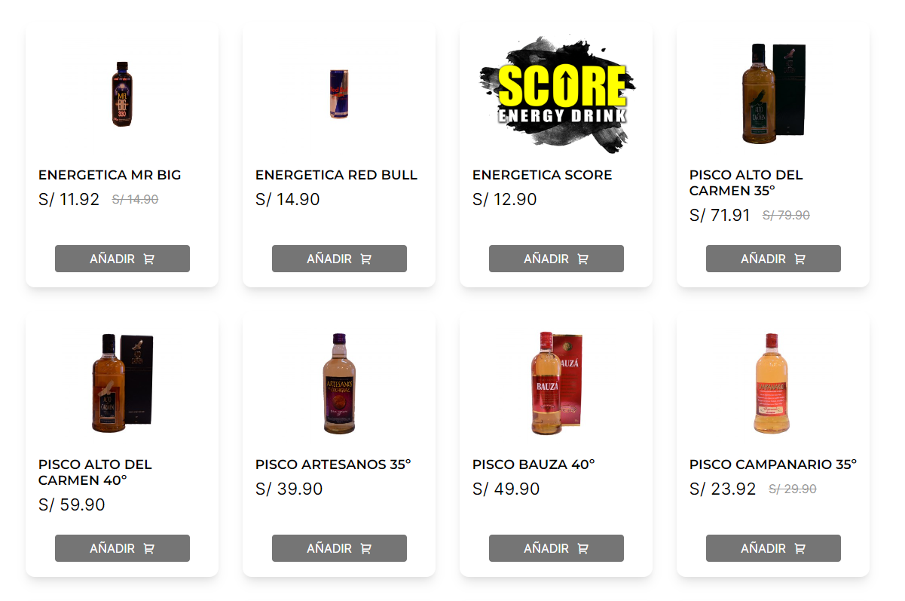
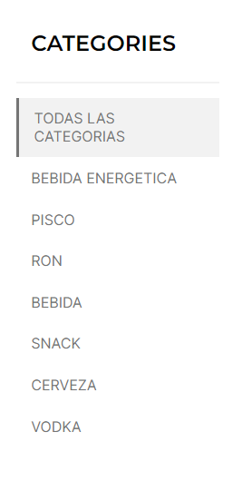
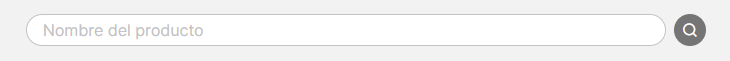

# Bsale-app

## About the website
Bsale-app is the front-end solution (SPA) of an online store connected to Bsale-api.

## Home page

In this page you can see all the products of the database.

Each card includes this information of the product:
- Image (if it has an image)
- Name
- Price
- Price with a discount (if it has a discount)
- Add button

On the left side there is a menu with all categories of the products, by default is selected the menu "Todas las categorias", you can select what category of products you want to see by clicking on the category name.

At the top there is a search bar where you can search for specific products. 

